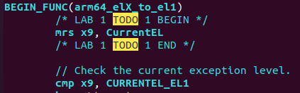
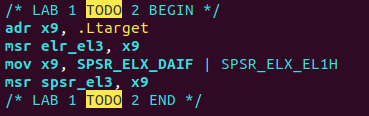
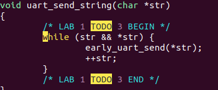
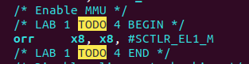
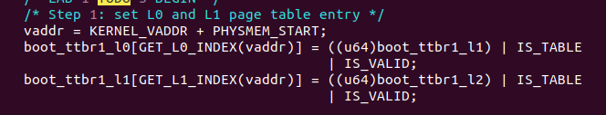
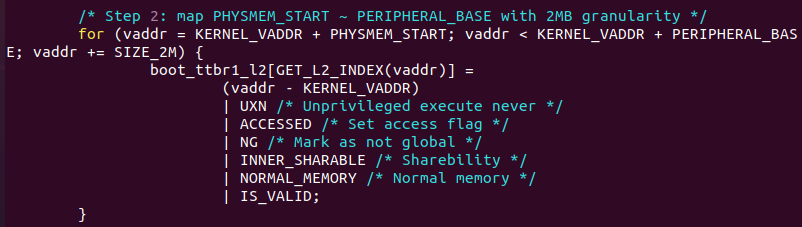
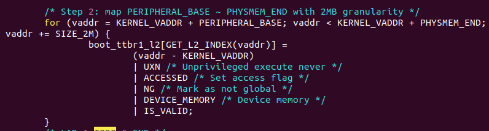
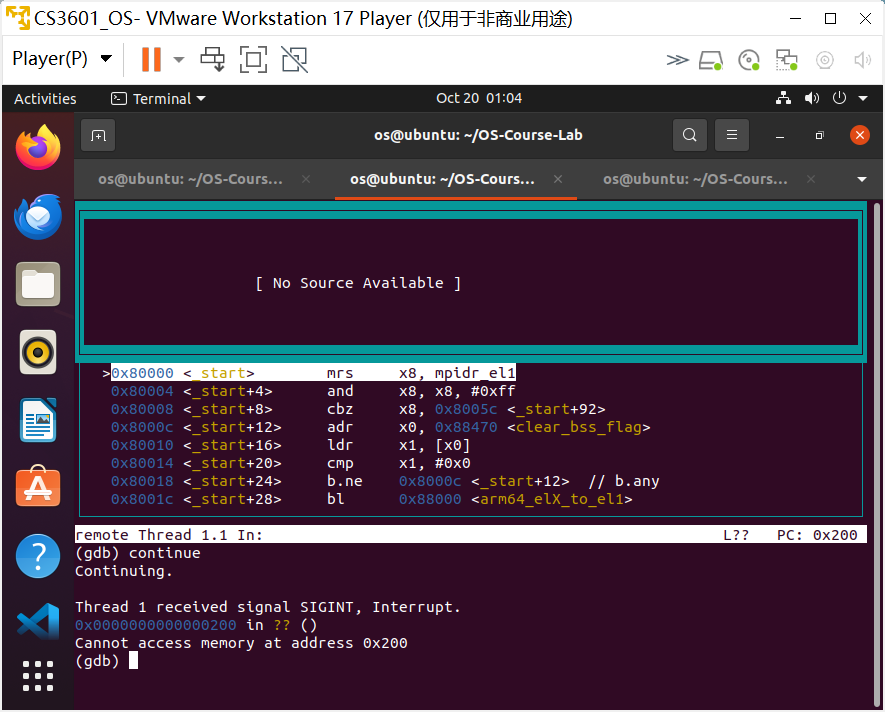

# ChCore 实验1 报告

## 思考题1

`_start` 函数的开头的开头为：

```
BEGIN_FUNC(_start)
        mrs     x8, mpidr_el1
        and     x8, x8, #0xFF
        cbz     x8, primary
       
wait_for_bss_clear:
        adr     x0, clear_bss_flag
        ldr     x1, [x0]
        cmp     x1, #0
        bne     wait_for_bss_clear
```

流程说明：

* 首先将 mpidr_el1 的值读取到寄存器 x8 中
* 然后通过掩码操作，将相应的 core id 信息提出出来
* `cbz` 指令判断 x8 的值（即 core id）是否为0
  * 如果为0，即确认为0号CPU核心，跳转到 `primary` ，进入初始化流程
  * 如果不为0，则不是0号CPU核心，继续向下执行，进入 `wait_for_bss_clear` 代码段，这是一段循环代码，直到 bss clear 才会退出循环。从而实现其它核的暂停执行


## 练习题2



* 由下条指令可知，需要将CPU当前异常级别 `CurrentEL` 读取到寄存器 `x9` 用于后续判断
* 因此指令为 ` mrs x9, CurrentEL`


## 练习题3



* 首先需要将返回地址保存到 `elr_el3`

  * 参考之前的代码：

    ```
    cmp x9, CURRENTEL_EL1
    beq .Ltarget
    ```

    知道返回地址为 `.Ltarget`

  * 因此设置 `elr_el3` 的代码为：

    ```
    adr x9, .Ltarget
    msr elr_el3, x9
    ```

* 然后设置 EL3 的状态寄存器 `spsr_el3`

  * 需要保存的值为 `SPSR_ELX_DAIF | SPSR_ELX_EL1H`

  * 因此代码为：

    ```
    mov x9, SPSR_ELX_DAIF | SPSR_ELX_EL1H
    msr spsr_el3, x9
    ```


## 思考题4

C函数的函数调用需要编译器配置栈，应用程序使用的栈是操作系统配置的。但操作系统初始化时没有栈，因此调用C函数前，操作系统需要为自己先启动栈。

如果不设置，C函数中需要调用栈的部分代码将无法正常运行。


## 思考题5

在实验1中，其它CPU核处于循环当中，只有当清零了 `.bss` 段后才会退出循环。因此如果不清理 `.bss` 段，之后涉及到多核任务，其它核将无法正常工作。


## 练习题6



已经给出了 `early_uart_init` 和 `early_uart_send` 函数。因此输出字符串只需要遍历字符串中的单个字符，运行 `early_uart_send` 分别输出即可。

遍历过程中，通过 `while (str && *str)` 来判断 str 是否为NULL、str是否指向字符串结尾，从而结束字符串输出。


## 练习题7



* 由上条指令得知，已经将 `sctlr_el1` 的值读取到 `x8` 中，接下来需要启用MMU，即启用 `M` 对应字段
* 因此通过按位与来改变 `M` 对应字段，代码为 `orr x8, x8, #SCTLR_EL1_M`


## 思考题8

多级页表相比单级页表：

* 优势：
  * 多级页表可以根据实际需要动态分配内存，不需要为整个地址空间分配一个庞大的表格，从而节省内存。
* 劣势：
  * 多级页表的逐级查询机制增添了页表访问次数
  * 多级页表的实现和维护更复杂

---

* 4KB粒度
  * 页表页大小为4KB，一个3级页表可翻译的地址范围是$2^{12}*2^9=2^{21}$
  * 需要 $2^{32} / 2^{21} = 2^{11}$ 个3级页表，对应 $2^{11}/2^9=4$ 个2级页表，1个1级页表，1个0级页表
  * 共 $1+1+4+2^{11} = 2054$ 个页表页
* 2MB粒度
  * 页表页大小为2MB，一个2级页表可翻译的地址范围是 $2^{21} * 2^9 = 2^{30}$
  * 需要 $2^{32} / 2^{30} = 4$ 个2级页表，对应1个1级页表，1个0级页表
  * 共 $1 + 1 + 4 = 6$ 个页表页


## 练习题9







* 在函数中已经为低地址配置了页表，因此配置高地址只需要额外考虑地址偏移，并稍作修改
* 此外，高地址不需要考虑字段`NG`          


## 思考题10

因为在启动MMU之后的操作系统必须使用虚拟地址，因此低地址也需要配置页表。

验证：

如下图，在注释掉地址值页表配置相关代码后，MMU翻译出错，错误地尝试访问地址`0x200`。只有配置好低地址页表，才能访问到真实物理地址。

